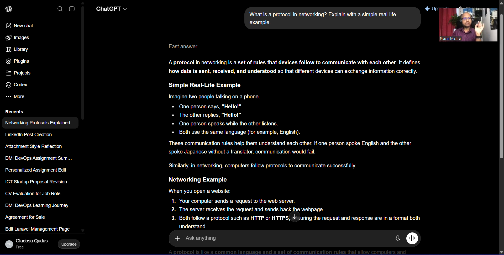
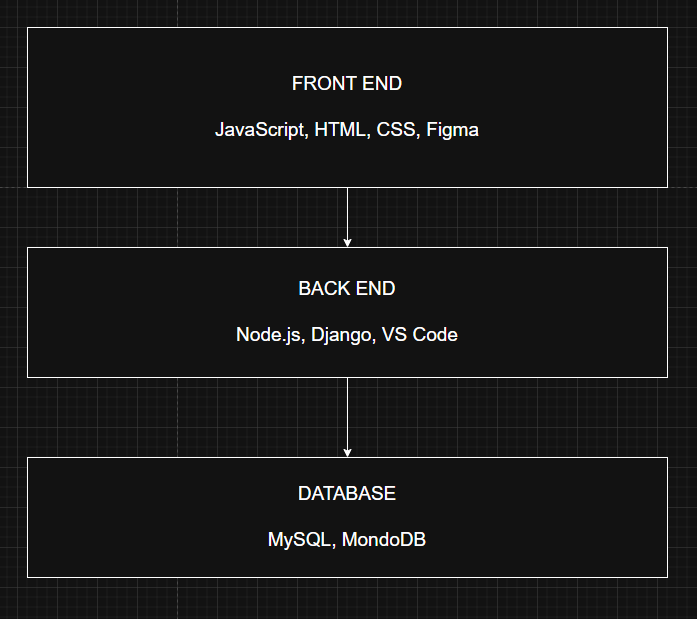
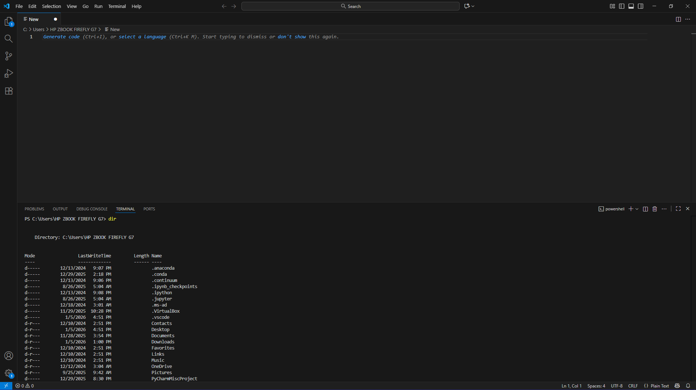

# Week 00 - Internet and Networking

Part of the DevOps Micro Internship (DMI) Cohort 3 with Agentic AI

---

# 🧑‍💻 Task 1: Using ChatGPT as Your Learning Assistant

## Scenario

You're new to DevOps and will frequently encounter technical questions. ChatGPT can be your learning companion.

## Your Task

Write a clear ChatGPT prompt to help you understand:

> "What is a protocol in networking? Explain with a simple real-life example."

Take a screenshot of your interaction showing:

* Your detailed prompt (with clear expectations)
* ChatGPT's simplified response with an example

## Screenshot

Save your screenshot in the `screenshots` folder and update the file name below.




Replace `task-1-chatgpt.png` with your actual screenshot file name.

---

## What I Learned (2–3 lines)

A protocol is a set of rules and standards that govern how data is transmitted and received between devices in a network. It ensures reliable and accurate communication.

---

# 🌐 Task 2: Internet and Networking

## Scenario

Your friend is launching an online bookstore named **EpicReads**.

He asked you to explain how users globally can access his website hosted in Finland.

## Your Task

Write a short explanation (**100–150 words**) that includes:

* Packet Switching
* IP Address
* TCP/IP
* HTTP/HTTPS

💡 **Tip:** You may use ChatGPT (as demonstrated in Task 1) to refine your explanation.

## Answer

When a user accesses EpicReads, they enter the domain in a browser. The browser sends a DNS request to resolve the domain into the server’s IP address in Finland. Once the IP is known, an HTTP/HTTPS GET request is sent. Using packet switching and the TCP/IP protocol, packets travel across routers until reaching the server, which responds with the requested webpages. TCP ensures reliable delivery while IP handles addressing and routing.

---

# 🏗️ Task 3: Application Architecture & Stack

## Scenario

EpicReads bookstore has two application versions:

### Two-Tier Application

* Frontend
* Database

### Three-Tier Application

* Frontend
* Backend
* Database

## Your Task

* Draw simple diagrams (hand-drawn or tool-based such as draw.io)
* Label each layer clearly
* List at least two common technologies or tools used for each layer
* Submit a screenshot or photo clearly showing your own drawing

## Diagram Screenshot / Photo

Save your diagram image in the `screenshots` folder and update the file name below.




Replace `task-3-diagram.png` with your actual diagram file name.

---

## Technologies Used

### Frontend

* JavaScript
* HTML
* CSS 
* Figma


### Backend

* Node.js
* Django
* VS Code

### Database

* MySQL
* MongoDB
* Amazon RDS

---

# 🌍 Task 4: Domain Name & DNS (Basic Concepts)

## Scenario

Your friend's bookstore **EpicReads** is currently accessible through:

```text
52.172.142.222:3000
```

He purchased the domain:

```text
epicreads.com
```

## Your Task

In **50–100 words**, explain in your own words:

1. What is DNS (Domain Name System)?
2. Which DNS record type should be used to connect the domain to the given IP, and why?

## Answer

Domain name is the human readable text that is used to depict a web server hosted on the internet. Computers cannot understand these texts so it has to be interpreted into an IP address, this interpretation is done by the DNS(Domain Name System) server. If the DNS server does not have a record for the website being queried, it will send the request to other servers till it gets the appropriate IP address. The DNS record type for EpicReads should be Name Server record type, this would direct query request to the appropriate servers that have the DNS record.

---

# 💻 Task 5: Visual Studio Code Setup (Hands-on)

## Your Task

Install Visual Studio Code (if not already installed).

Take a screenshot of your VS Code environment showing:

* Terminal open inside VS Code
* Running a basic command:

### Windows

```powershell
dir
```

### Linux / macOS

```bash
pwd
ls
```

* Your selected VS Code theme clearly visible

⚠️ **Important:** The screenshot must show your username or another identifiable detail to confirm it is your environment.

## Screenshot

Save your screenshot in the `screenshots` folder and update the file name below.




Replace `task-5-vscode.png` with your actual screenshot file name.

---

# 🔗 Task 6: Publish Your Assignment as a LinkedIn Post

## Objective

Publishing on LinkedIn helps you:

* Build your professional online presence
* Reinforce your learning
* Document your DevOps journey publicly

## Your Task

Summarize your answers from Tasks 1–5 into a LinkedIn post.

Clearly structure your post into the following sections:

* ChatGPT
* Internet & Networking
* App Architecture
* DNS
* VS Code Setup

Add the following credit note at the end of your post:

> **P.S. This post is part of the DevOps Micro Internship (DMI) with Agentic AI — Cohort 3 — by Pravin Mishra. My graded progress is public: https://dmi.pravinmishra.com/s/YOUR-GITHUB-USERNAME.html · Start your DevOps journey: https://dmi.pravinmishra.com/?utm_source=student&utm_medium=ps-linkedin&utm_campaign=cohort3**

---

## LinkedIn Post URL

Paste your LinkedIn post URL here:

```
https://www.linkedin.com/posts/qudus-oladosu_i-made-a-major-move-towards-fulfilling-my-activity-7413980067833376768-IxuQ?utm_source=share&utm_medium=member_desktop&rcm=ACoAADJKiUcB2-kD6w7MGAUWTwb-d3Tp8qA3vuE

```

---

## LinkedIn Post Backup Copy

Paste the full text of your LinkedIn post here:

I made a major move towards fulfilling my dream of becoming a DevSecOps Engineer by enrolling for a Micro Internship with Pravin Mishra. This post contains my submission for the test tasks, hope you find it interesting.

Task 1: Using ChatGPT as Your Learning Assistant
I explored how to leverage AI to understand unfamiliar concepts. By giving ChatGPT specific prompts, I was able to get clear, detailed explanations on networking, application architecture, and DNS, which helped me learn faster and more efficiently.

Task 2: Internet and Networking
When a user accesses EpicReads, they enter the domain in a browser. The browser sends a DNS request to resolve the domain into the server’s IP address in Finland. Once the IP is known, an HTTP/HTTPS GET request is sent. Using packet switching and the TCP/IP protocol, packets travel across routers until reaching the server, which responds with the requested webpages. TCP ensures reliable delivery while IP handles addressing and routing.

Task 3: Application Architecture & Stack
Frontend: JavaScript, HTML, CSS, Figma
Backend: Node.js, Django, VS Code
Database: MySQL, MongoDB

Task 4: Domain Name & DNS (Basic Concepts)
A domain name is a human-readable address for a website. DNS translates it into an IP address. For EpicReads, the NS (Name Server) record is used to direct queries to the correct DNS servers, ensuring users can access the website.

Task 5: Visual Studio Code Setup (Hands-on)
This task was to setup VS Code used for both backend and frontend development to streamline coding and debugging workflows.


P.S. This post is part of the FREE DevOps Micro Internship Cohort run by Pravin Mishra. You can start your DevOps journey for free from his YouTube Playlist.

---

# Reflection – Week 0

### What did you find easy?

Using AI to improve my write-ups was straightforward, it helped me create clearer, more structured content and I could produce higher-quality work in less time.


---

### What was difficult?

Organizing my thoughts into writing before using AI was challenging. I often struggled to express technical ideas clearly so it took time to structure my points logically.


---

### What will you improve next week?

I plan to focus on gaining deeper technical understanding. I want to apply concepts more confidently in practice, this will help me write and explain content independently.


---

## 📌 About DMI & CloudAdvisory

DevOps Micro Internship (DMI) is a project-based DevOps program run by Pravin Mishra (The CloudAdvisory) focused on real-world execution, systems thinking, and career readiness.

It helps learners build strong DevOps foundations with hands-on experience.


## 📌 Resources

- 🌐 **DMI Official Website:** https://dmi.pravinmishra.com?utm_source=github&utm_medium=readme  
- 🎓 **University:** https://university.pravinmishra.com?utm_source=github&utm_medium=readme  
- 💬 **Discord Community:** https://discord.pravinmishra.com?utm_source=github&utm_medium=readme  
- 📝 **Blog:** https://dmi.pravinmishra.com/blog?utm_source=github&utm_medium=readme  
- ▶️ **YouTube Playlist (DMI Cohort 3):** https://www.youtube.com/playlist?list=PLFeSNDtI4Cho  
- 🔗 **Pravin Mishra (LinkedIn):** https://www.linkedin.com/in/pravin-mishra-aws-trainer/  
- 🏢 **CloudAdvisory (LinkedIn):** https://www.linkedin.com/company/thecloudadvisory/

---

*This submission is part of DevOps Micro Internship (DMI) Cohort 3 — Agentic AI Track*