# Assignment 5 — Bash Script Automation Drill (OPS Checklist)

Part of the DevOps Micro Internship (DMI) Cohort 3 with Agentic AI

---

## Purpose

In this assignment, you will practice Bash scripting by building a series of small automation scripts covering environment setup, variables, arrays, loops, file conditionals, if-else logic, and functions. These scripts form the foundation of real-world Linux automation used in DevOps, cloud, and production support environments.

---

# Task 1 — Bash Environment & Workspace Setup

## Goal

Verify that Bash is available on your system and create a clean workspace for this assignment.

### Evidence

#### Screenshot 1 — Output of `echo $SHELL` and `bash --version`

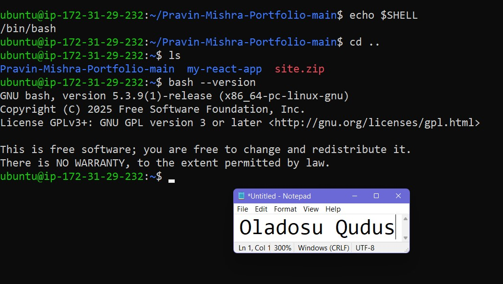

---

#### Screenshot 2 — Output of `pwd` and `ls -lah` showing the scripts directory

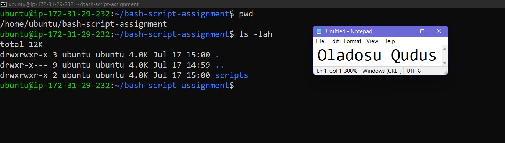

---

### Notes

Answer the following in your own words:

**1. What is Bash?**

Bash (short for Bourne Again Shell) is a text-based command language and program that lets users talk to the computer's operating system.

---

**2. What is the difference between shell and Bash?**

Shell is any user interface that allows the user to interact with the operating system while bash is a type of shell created for GNU Projects.

---

**3. Why is it important to confirm the Bash version before writing scripts?**

This ensures compatibility as older versions of bash does not support some modern features.

---

# Task 2 — Your First Bash Script

## Goal

Create your first Bash script, make it executable, and run it from the terminal.

### Evidence

#### Screenshot 1 — Content of `first-script.sh`

---

#### Screenshot 2 — Output of `./first-script.sh`

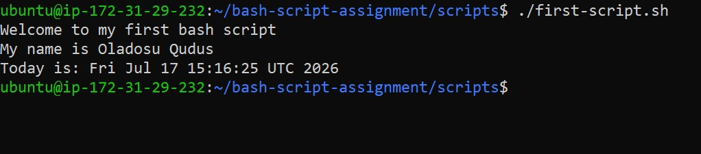

---

#### Screenshot 3 — Output of `ls -l first-script.sh` showing executable permission

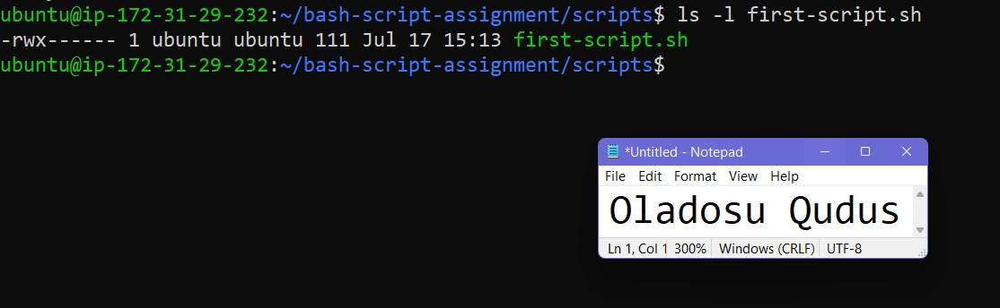

---

### Notes

Answer the following in your own words:

**1. What is the purpose of `#!/bin/bash`?**

#!/bin/bash is called shebang. It tells the operating system which interpreter to use for running the commands inside the script. 

---

**2. Why do we use `chmod +x` before running a script?**

That command gives execute right on the file

---

**3. What is the difference between running a script using `./script.sh` and `bash script.sh`?**

Running the script using "./script.sh" requires the user to have execute right on the file but "bash script.sh" does not.

---

# Task 3 — Variables: User Information Script

## Goal

Use variables to store and display user-related information.

### Evidence

#### Screenshot 1 — Content of `user-info.sh`

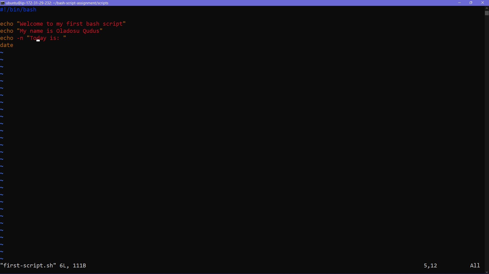

---

#### Screenshot 2 — Output of `./user-info.sh`

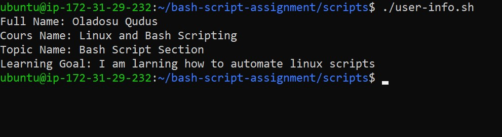

---

### Notes

Answer the following in your own words:

**1. What is a variable in Bash?**

A variable is an object declared in a bash script with a fixed value. 

---

**2. Why should we avoid spaces around the `=` sign when creating variables?**

Because Bash interprets the first word of any line as a command to execute and any subsequent words separated by spaces as arguments passed to that command.

---

**3. How do you access the value stored inside a Bash variable?**

The value can be called in the script by adding "$" before the variable name e.g $filename.

---

# Task 4 — Arrays & Loops: Tools Checklist Script

## Goal

Use arrays and loops to print a checklist of tools used in Bash scripting.

### Evidence

#### Screenshot 1 — Content of `tools-checklist.sh`

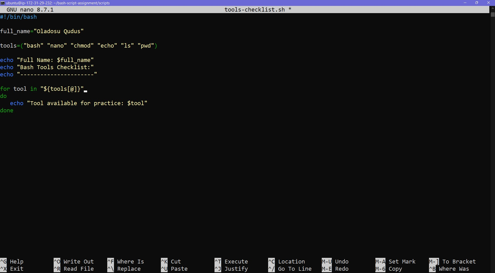

---

#### Screenshot 2 — Output of `./tools-checklist.sh`

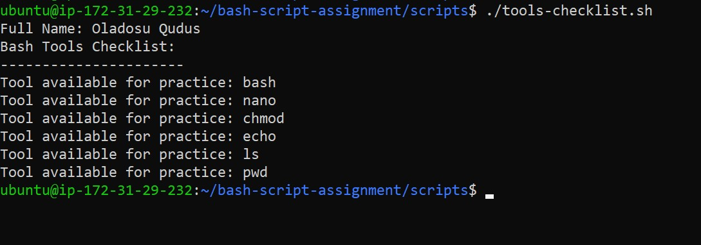

---

### Notes

Answer the following in your own words:

**1. What is an array in Bash?**

An array is used to store multiple values into one variable.

---

**2. Why are arrays useful in scripts?**

Arrays are useful in scripts because they allow us to store multiple pieces of related data inside a single variable name instead of creating separate variables.

---

**3. What does `"${tools[@]}"` mean?**

"${tools[@]}" is the special syntax used to expand and return all items inside an array safely, preserving each item exactly as it is.

---

**4. What is the purpose of the `for` loop in this script?**

"for" is a command for executing repetitive tasks. The purpose of the for loop in this script is to automatically cycle through the list of applications defined in the tools array and print a statement for each one.

---

# Task 5 — Loops: Number Counter Script

## Goal

Use loops to repeat a task multiple times.

### Evidence

#### Screenshot 1 — Content of `counter.sh`

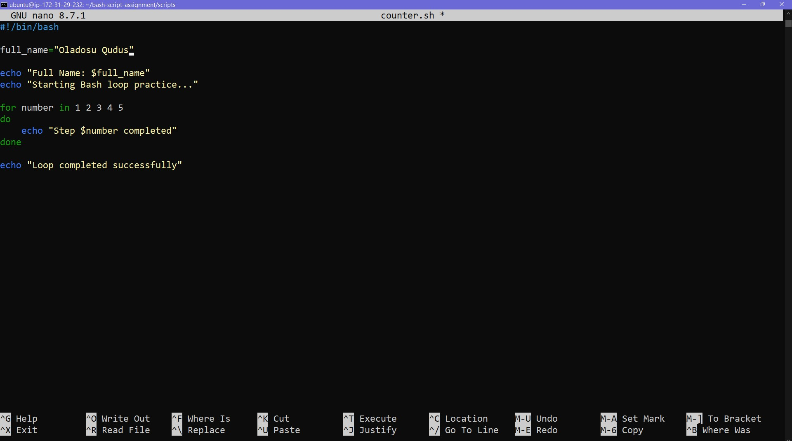

---

#### Screenshot 2 — Output of `./counter.sh`

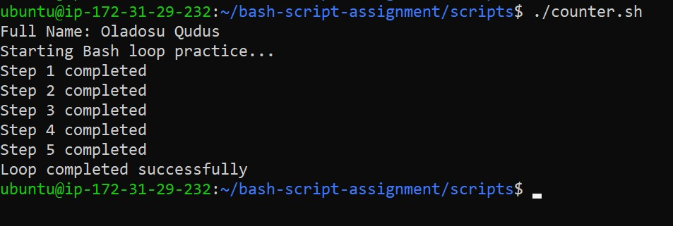

---

### Notes

Answer the following in your own words:

**1. What is a loop?**

A loop is a block of code that is repeated as long as a condition is met.

---

**2. Why do we use loops in Bash scripting?**

Loops are used when there's need to run a block of code multiple times.

---

**3. How many times did the loop run in your script?**

The loop in the counter.sh script ran 5 times.

---

**4. What would you change if you wanted the loop to run 10 times?**

To make the loop run 10 times, i'll extend the condition to "for number in 1 2 3 4 5 6 7 8 9 10" or use braces like "for number in {1..10}"

---

# Task 6 — Files & Conditionals: File Validation Script

## Goal

Use file checks and conditionals to verify whether files and directories exist.

### Evidence

#### Screenshot 1 — Output of `ls -lah ../test-folder`

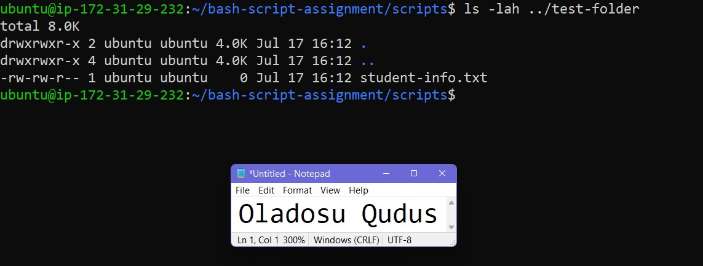

---

#### Screenshot 2 — Content of `file-check.sh`

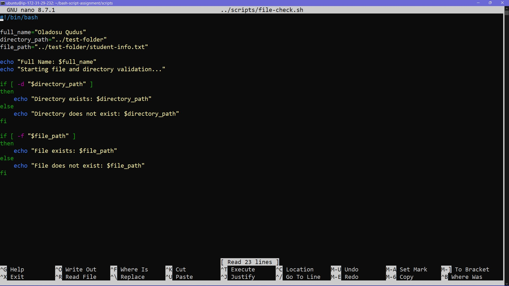

---

#### Screenshot 3 — Output of `./file-check.sh`

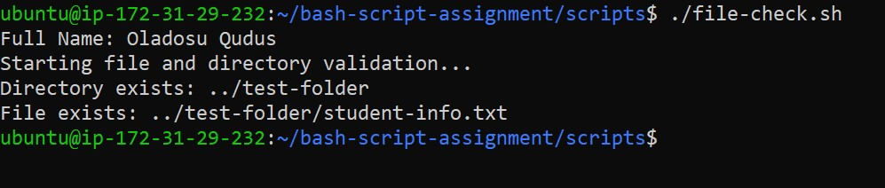

---

### Notes

Answer the following in your own words:

**1. What does `-d` check in Bash?**

The '-d' option in bash is used to check if a direcctory exists.

---

**2. What does `-f` check in Bash?**

The '-f' option is used to check if a file exists.

---

**3. Why should file and directory paths be stored in variables?**

It makes it easier to understand and read the script and avoid syntax mistakes.

---

**4. What happens if the file does not exist?**

If the file does not exist, the command will return false and the output will be "File does not exist: ../test-folder/student-info.txt"

---

# Task 7 — Conditionals: Pass or Retry Script

## Goal

Use if-else conditionals to make decisions based on a variable value.

### Evidence

#### Screenshot 1 — Content of `score-check.sh` with `score=85`

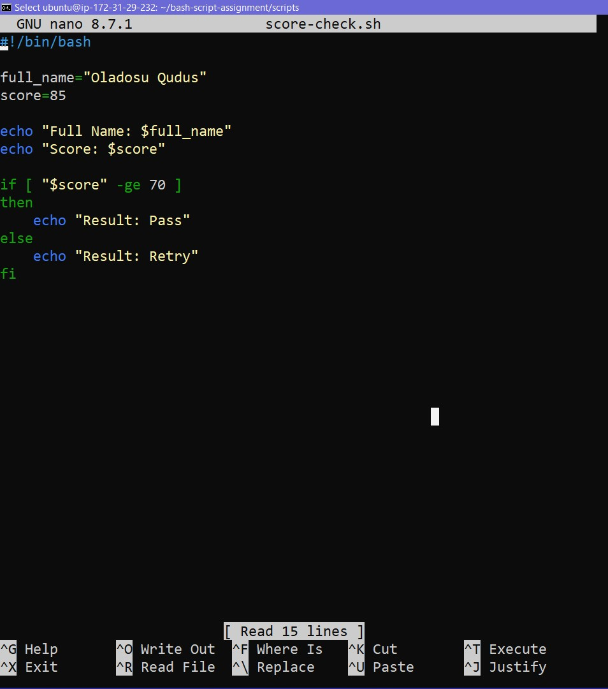

---

#### Screenshot 2 — Output showing `Result: Pass`

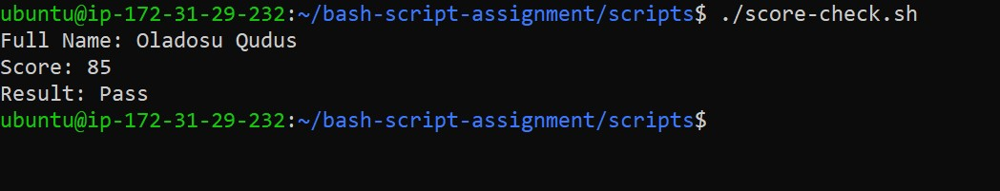

---

#### Screenshot 3 — Content of `score-check.sh` with `score=55`

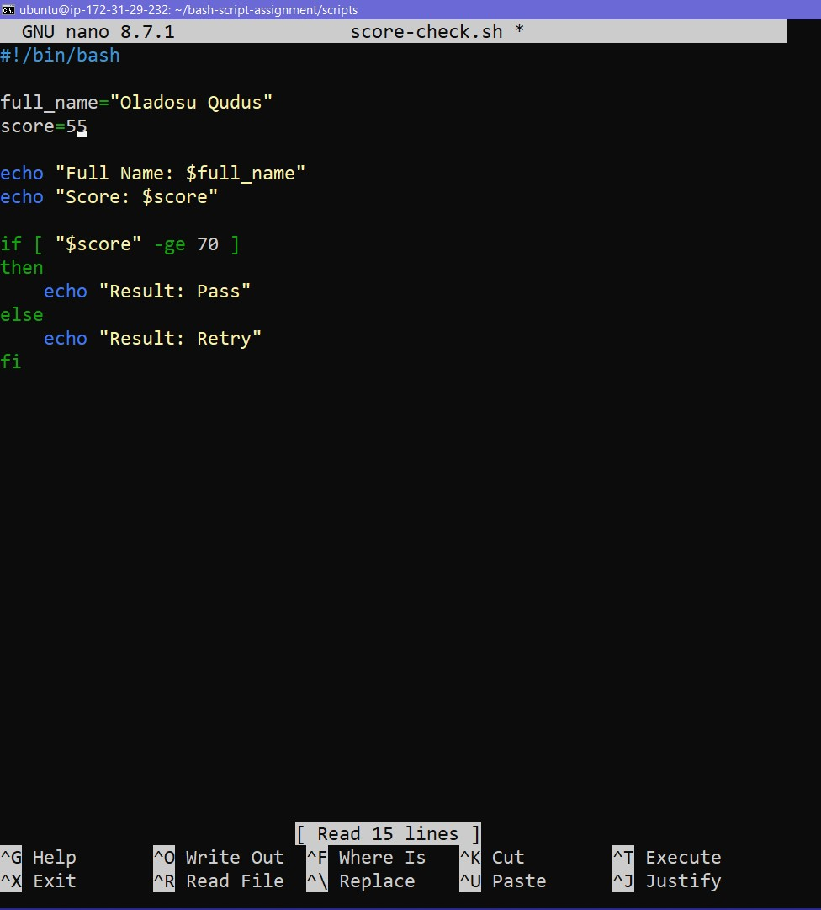

---

#### Screenshot 4 — Output showing `Result: Retry`

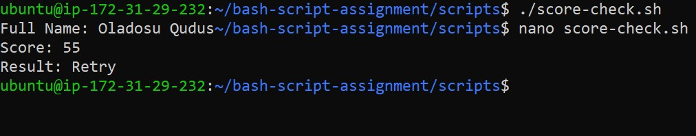

---

### Notes

Answer the following in your own words:

**1. What is the purpose of if-else in Bash?**

"if-else" tells bash to run a different set of codes if the condition for the if loop is false

---

**2. What does `-ge` mean?**

-ge means greater than or equal to

---

**3. Why should conditions be tested with different values?**

It allows us to see how the system will respond in varying conditions

---

**4. How can conditionals help in automation scripts?**

Conditionals help to define different set of actions to be performed under different conditions

---

# Task 8 — Functions: Final Bash Automation Script

## Goal

Create a final Bash script using functions to organize reusable code.

### Evidence

#### Screenshot 1 — Content of `final-automation.sh`

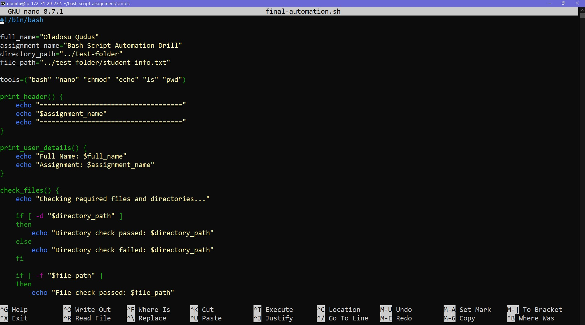

---

#### Screenshot 2 — Output of `./final-automation.sh`

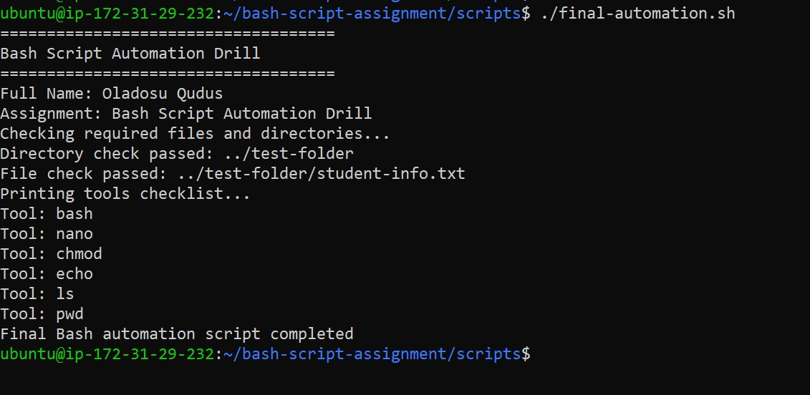

---

#### Screenshot 3 — Output of `ls -lah` showing all created scripts

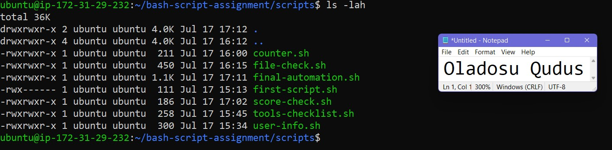

---

### Notes

Answer the following in your own words:

**1. What is a function in Bash?**

A function in Bash is a self-contained block of reusable code designed to perform a specific task. You define the block once, give it a unique name, and then call that name anywhere later in your script to execute the commands inside it.

---

**2. Why are functions useful in scripts?**

Functions are useful because they prevent you from repeating the same code blocks, making your scripts cleaner and easier to manage

---

**3. Which functions did you create in this script?**

print_header
print_user_details
check_files
print_tools

---

**4. How does this final script combine variables, arrays, loops, conditionals, files, and functions?**

The script uses variables for the user's name, assignment details, and file paths, while an array and a "for" loop manage the sequential printing of tool names. It employs "if-else" conditionals with -d and -f flags to verify the existence of required directories and files. To ensure clean execution, the commands are grouped into functions and called sequentially.

---

# LinkedIn Post (Required)

## Evidence

#### LinkedIn Post URL

Paste your LinkedIn post URL here:

`https://www.linkedin.com/posts/qudus-oladosu_dmi-cohort-4-live-micro-internship-waiting-share-7483934634435747840-Ms8s/?highlightedUpdateUrn=urn%3Ali%3Aactivity%3A7483934635547303936&highlightedUpdateType=SOCIAL_SHARE&origin=SOCIAL_SHARE&utm_source=share&utm_medium=member_desktop&rcm=ACoAADJKiUcB2-kD6w7MGAUWTwb-d3Tp8qA3vuE`

---

#### Screenshot — Published LinkedIn post

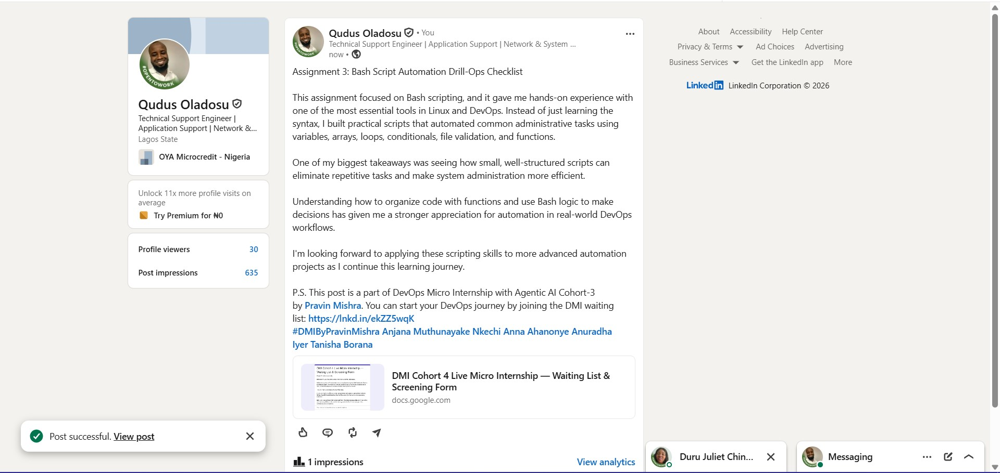

---

# Submission Instructions

- Add all required screenshots in your submission
- Full name must be visible in required screenshots
- All script files must be created and run successfully
- Required notes must be answered clearly for every task
- Do not expose sensitive information (keys, passwords, credentials)

---

# Completion Checklist

- [ ] Task 1: Environment setup verified, workspace created (Screenshots 1–2, Notes answered)
- [ ] Task 2: First script created, executed, permissions verified (Screenshots 1–3, Notes answered)
- [ ] Task 3: Variables script created and run (Screenshots 1–2, Notes answered)
- [ ] Task 4: Arrays and loops script created and run (Screenshots 1–2, Notes answered)
- [ ] Task 5: Counter loop script created and run (Screenshots 1–2, Notes answered)
- [ ] Task 6: File validation script created and run (Screenshots 1–3, Notes answered)
- [ ] Task 7: Pass/Retry conditional script tested with both values (Screenshots 1–4, Notes answered)
- [ ] Task 8: Final automation script created and run (Screenshots 1–3, Notes answered)
- [ ] All scripts run without errors
- [ ] Full Name visible in all required screenshots
- [ ] LinkedIn post published and URL submitted
- [ ] No sensitive data exposed

---

## 📌 About DMI & CloudAdvisory

DevOps Micro Internship (DMI) is a project-based DevOps program run by Pravin Mishra (The CloudAdvisory) focused on real-world execution, systems thinking, and career readiness.

It helps learners build strong DevOps foundations with hands-on experience.

---

## 📌 Resources

- 🌐 DMI Official Website: https://pravinmishra.com/dmi  
- 🎓 DevOps for Beginners (Udemy): https://www.udemy.com/course/devops-for-beginners-docker-k8s-cloud-cicd-4-projects/  
- 🎓 Agentic AI DevOps with Claude Code: https://www.udemy.com/course/ultimate-agentic-ai-devops-with-claude-code/  
- 🎓 DevOps with Claude Code: Terraform, EKS, ArgoCD & Helm: https://www.udemy.com/course/devops-with-claude-code-terraform-eks-argocd-helm/  
- ▶️ YouTube Playlist: https://www.youtube.com/playlist?list=PLFeSNDtI4Cho  
- 🔗 Pravin Mishra (LinkedIn): https://www.linkedin.com/in/pravin-mishra-aws-trainer/  
- 🏢 CloudAdvisory (LinkedIn): https://www.linkedin.com/company/thecloudadvisory/

---

*This submission is part of DevOps Micro Internship (DMI) Cohort 3 — Agentic AI Track.*