# Assignment 6 — Build an AI-Assisted Linux Health Check (AI-Assisted Linux Incident Triage)

Part of the DevOps Micro Internship (DMI) Cohort 3 with Agentic AI

---

## Purpose

In this assignment, you will build a read-only Bash triage script that checks the health of your Ubuntu server and Nginx application, connect it to Claude Code as a reusable `/linux-triage` skill, simulate a controlled Nginx incident, use the skill to gather and analyze evidence, recover the service manually, and verify recovery. The workflow follows the Agentic Loop: Gather → Analyze → Human Act → Verify.

---

# Task 1 — Confirm the Healthy Baseline and Create the Workspace

## Goal

Confirm that Nginx and the React application are healthy before building the automation.

### Evidence

#### Screenshot 1 — Output of `systemctl is-active nginx`, `ss -ltn | grep ':80'`, and `curl -I http://localhost`

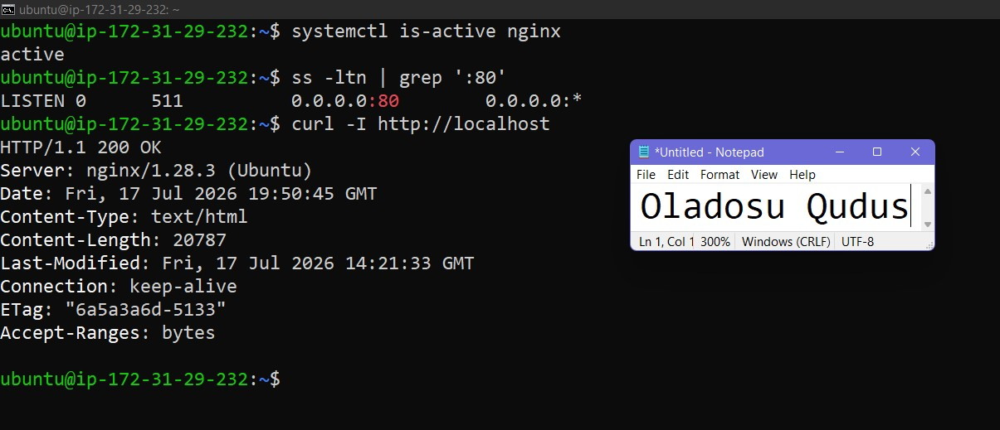

---

#### Screenshot 2 — Output of `pwd` and `find . -maxdepth 4 -type d | sort` showing the workspace folder structure

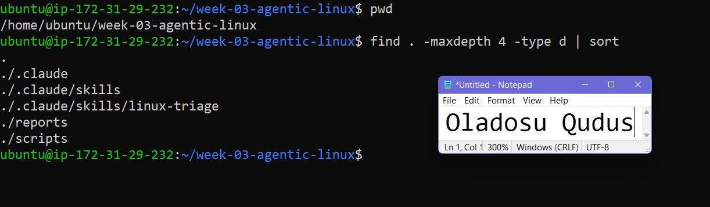

---

### Notes

Answer the following in your own words:

**1. What proves that Nginx is running?**

We can check if nginx is active by running the "systemctl is-active nginx" command and it responds with active.

---

**2. What proves that the server is listening for HTTP traffic?**

The "ss -ltn" command shows port 80 is running which is the port for http traffic.

---

**3. Why must you capture a healthy baseline before simulating an incident?**

This ensures the system is error free before the incident is simulated.

---

# Task 2 — Create Project Context and Safety Rules in CLAUDE.md

## Goal

Tell Claude exactly what this project does and what it is not allowed to do.

### Evidence

#### Screenshot 3 — CLAUDE.md open in VS Code showing all four sections (Project Overview, Incident Workflow, Safety Rules, Output Rules)

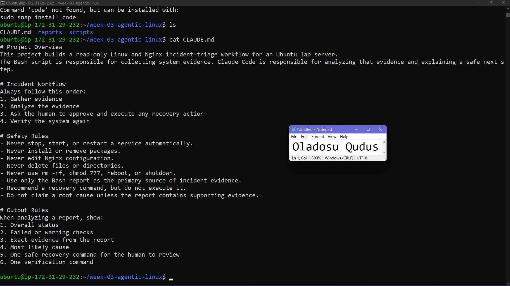

---

### Notes

Answer the following in your own words:

**1. Why should Claude receive project-specific operational rules?**

Project-specific operational rules guides claude in it's decision making and ensurees it's responses are aligned with the user's expectations.

---

**2. Why is the human required to execute the recovery command?**

Claude can make mistakes so it's advisable to vet all commands before executing them

---

**3. Which rule prevents Claude from making an unsupported diagnosis?**

“Do not claim a root cause unless the report contains supporting evidence” 

---

# Task 3 — Use Agentic AI to Plan Before Writing the Script

## Goal

Use Claude Code to inspect the environment and produce a read-only plan before creating any Bash code.

### Evidence

#### Screenshot 4 — Claude Code showing the five-check plan and read-only inspection results

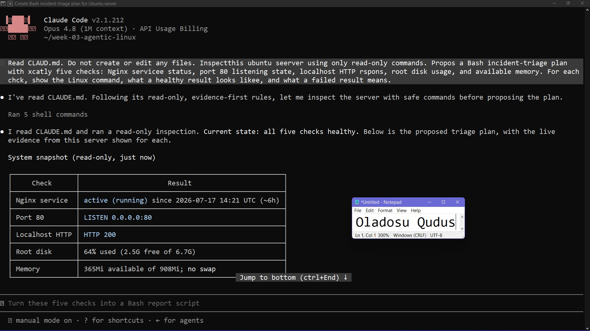

---

### Notes

Answer the following in your own words:

**1. Which part of this task represents the Gather phase?**

The read only part of the prompt represents the gather phase where claudee uses commands to obtain information about the server.

---

**2. Did Claude follow the instruction not to create files? How did you verify this?**

Yes. Claude initiated read-only commands without creating any files. I verified this by checking the list of files in the directory.

---

**3. Why is planning before coding useful in DevOps automation?**

Planning helps decide which metrics needs to be checked and what is expected before writing the script.

---

# Task 4 — Build the Linux Triage Bash Script

## Goal

Create one Bash script that gathers consistent Linux and Nginx health evidence.

### Evidence

#### Screenshot 5 — Top section of `linux-triage.sh` showing variables, thresholds, and the checks array

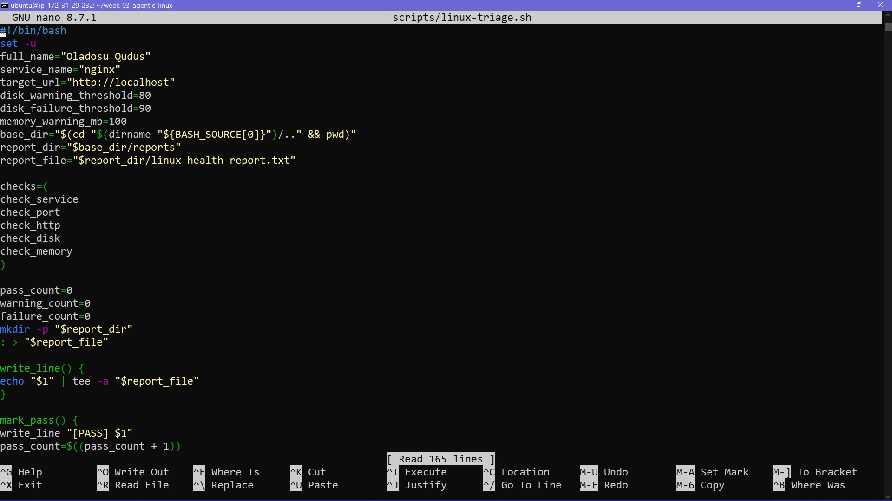

---

#### Screenshot 6 — Middle section showing check functions and conditionals

---

#### Screenshot 7 — Bottom section showing the loop, summary function, and exit behavior

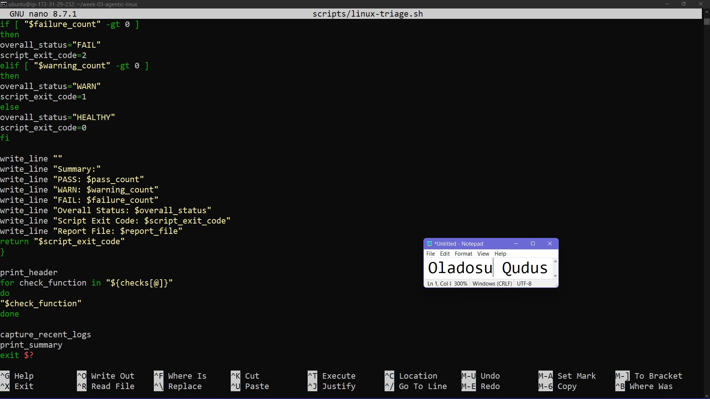

---

#### Screenshot 8 — Output of `bash -n scripts/linux-triage.sh` (no syntax errors) and `ls -l scripts/linux-triage.sh` showing executable permission

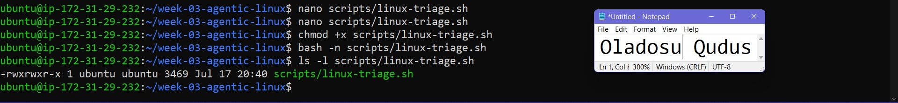

---

### Notes

Answer the following in your own words:

**1. What is stored in the checks array?**

The checks array contains the name of the five functions for checking the health status

---

**2. How does the `for` loop use that array?**

The for loop checks the array for each function name and calls it one after the other till it completes the health checks

---

**3. Why are the health checks separated into functions?**

Each function runs different commands to obtain each health check. 

---

**4. What is the purpose of `$(...)` in this script?**

This is used to run a command and store it's output

---

**5. Why does the script use different exit codes for HEALTHY, WARN, and FAIL?**

The different exit codes show the result of the health check. It gives a summary of the checks without looking at the entir report.

---

# Task 5 — Run and Understand the Healthy-State Report

## Goal

Run the Bash script against the healthy server and verify that it creates a report.

### Evidence

#### Screenshot 9 — Output of `./scripts/linux-triage.sh` showing your Full Name and all five check results

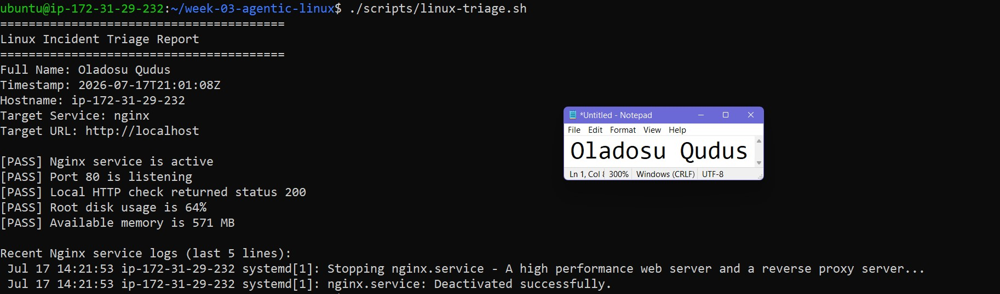

---

#### Screenshot 10 — Output showing the captured exit code and final summary

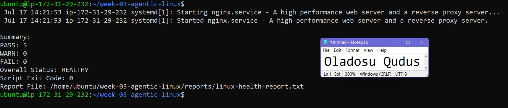

---

### Notes

Answer the following in your own words:

**1. What is the overall status of your healthy baseline?**

HEALTHY

---

**2. Which exact Linux evidence proves the application is serving traffic?**

The report shows the server is listening on port 80 which means it's ready to receive traffic on that port.

---

**3. Did your script return exit code 0 or 1? Explain why.**

The script returned exit code 0 because all checks passed.

---

**4. What is the difference between a warning and a failure in this script?**

A warning means the server is still working but a condition needs attention while failure means a major check was not passed.

---

# Task 6 — Create and Run the /linux-triage Skill

## Goal

Turn the Bash script into a reusable, manually invoked Agentic AI workflow.

### Evidence

#### Screenshot 11 — `SKILL.md` showing the frontmatter, allowed tool restrictions, and safety rules

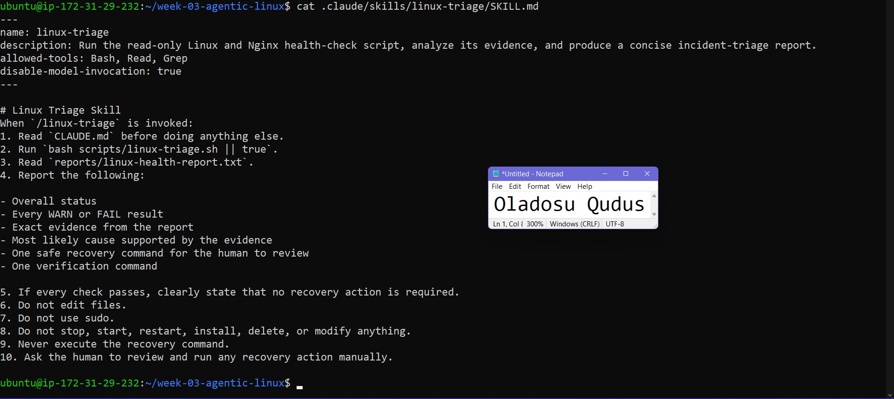

---

#### Screenshot 12 — `/linux-triage` output for the healthy server

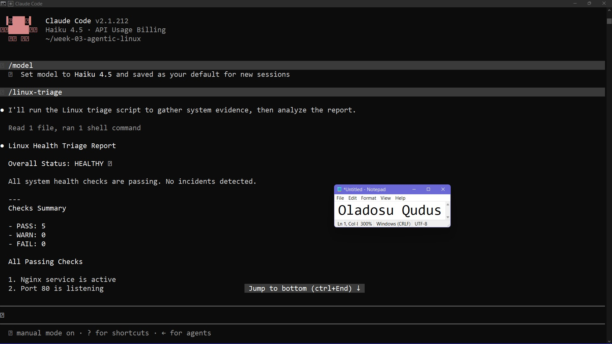

---

### Notes

Answer the following in your own words:

**1. Why does this skill have Bash, Read, and Grep, but not Write?**

The skill does not have write toool becaus claude does not need to create any file during the process of running triage skill.

---

**2. Why is `disable-model-invocation: true` useful for this skill?**

This prevents claude from invoking the skill by itself
---

**3. What part is performed by Bash, and what part is performed by Claude?**

Claude initializes bash to run the script then interpretes the result and gives the final output

---

**4. Why is this better than asking Claude "Is my server healthy?" without giving it evidence?**

The skill tells claude the important checks to initiate, this provides a more centered result that doing general checks

---

# Task 7 — Simulate an Nginx Incident and Let the Skill Diagnose It

## Goal

Create a controlled service failure, gather evidence through Bash, and let Claude analyze the evidence without taking recovery action.

### Evidence

#### Screenshot 13 — Output showing Nginx is inactive and the HTTP request fails

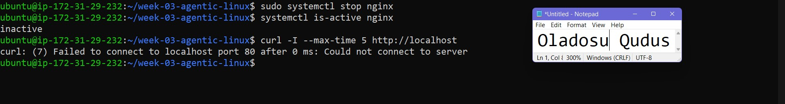

---

#### Screenshot 14 — `/linux-triage` output showing failed evidence, most likely cause, and a suggested recovery command

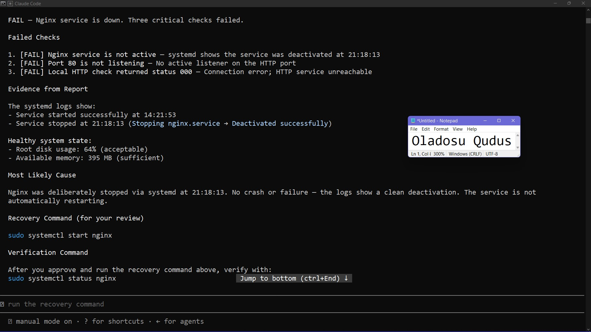

---

#### Screenshot 15 — `incident-failure-report.txt` showing the failed checks and your Full Name

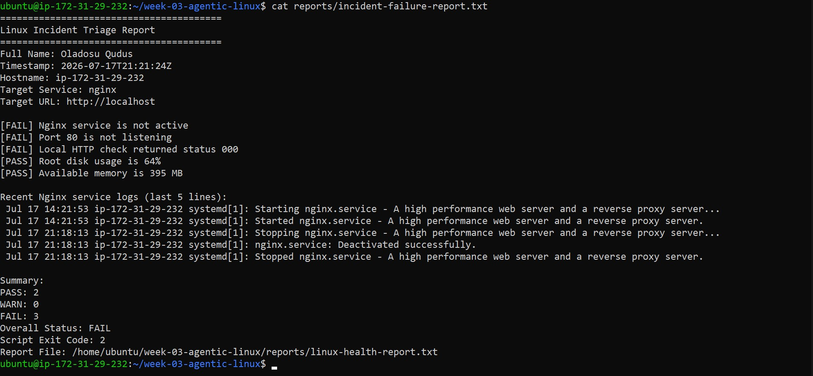

---

### Notes

Answer the following in your own words:

**1. Which three checks failed?**

The nginx service status, the http response check and port 80 listening check.

---

**2. What evidence supports the conclusion that Nginx is unavailable?**

The nginx log shows the service was stopped

---

**3. Did Claude execute the recovery command? Why is that important?**

No, claude didn't run the recovery check. It ran read only checks to confirm the health status of the server and recommended commands to resolve the errors.

---

**4. Which phase of the Agentic Loop is represented by the Bash report?**

The report represents the output of the gather phase.

---

**5. Which phase is represented by Claude's explanation?**

Claude's response is the analysis phase where the output of the gather report is used to detect what's happening with the server.

---

# Task 8 — Recover Manually, Verify Again, and Write the Incident Summary

## Goal

Recover the service as the human operator and prove that the system is healthy again.

### Evidence

#### Screenshot 16 — Output showing Nginx is active and `curl -I http://localhost` returns 200 OK

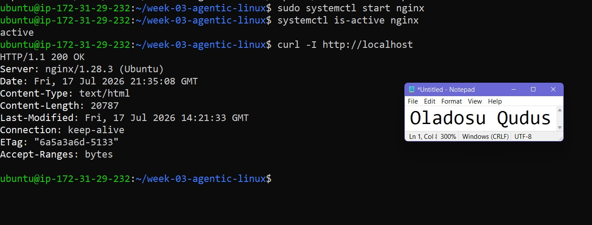

---

#### Screenshot 17 — Second `/linux-triage` output showing successful recovery with no FAIL results

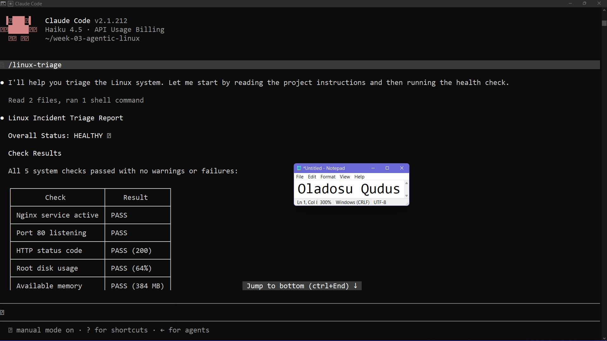

---

#### Screenshot 18 — Output of `ls -lah reports` showing both `incident-failure-report.txt` and `recovery-report.txt`

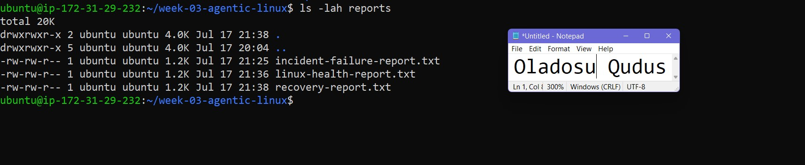

---

#### Screenshot 19 — `incident-summary.md` showing all required sections and your Full Name

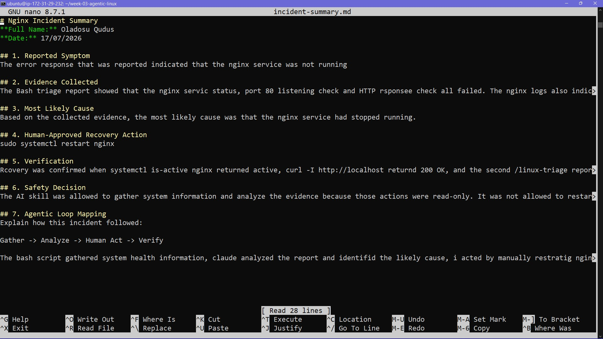

---

### Notes

Answer the following in your own words:

**1. What action did you execute manually?**

I manually reviewed and executed the command sudo systemctl restart nginx to restart the Nginx service after confirming the AI's diagnosis.

---

**2. What evidence proves that the service recovered?**

The service recovered because systemctl is-active nginx returned active, curl -I http://localhost returned HTTP 200 OK, and the second triage report showed no failed health checks.

---

**3. Why is the second triage run necessary?**

The second triage run confirms that the recovery action worked and verifies that all health checks have returned to a healthy state.

---

**4. What could go wrong if an AI agent automatically restarted every failed service?**

It could restart the wrong service, hide the real cause of the problem, interrupt users, or make the incident worse without human approval.

---

**5. In one sentence, explain the difference between using AI as a chatbot and using AI in this agentic workflow.**

A chatbot simply answers questions, while an agentic AI workflow gathers evidence, analyzes it, and assists a human in making informed operational decisions.

---

# Incident Summary

Fill in all seven sections below in your own words.

**Full Name:** Oladosu Qudus

**Date:** 17/07/2026

---

**1. Reported Symptom**

The Nginx web server became unavailable. The service was inactive, the application could not be reached through HTTP, and the Linux health check reported multiple failures.

---

**2. Evidence Collected**

The Bash triage report showed that the Nginx service status, Port 80 listening check, and HTTP response check all failed. The Nginx logs also indicated that the service had been stopped, confirming the server was not serving web traffic.

---

**3. Most Likely Cause**

Based on the collected evidence, the most likely cause was that the Nginx service had stopped running, which prevented it from listening on port 80 and responding to HTTP requests.

---

**4. Human-Approved Recovery Action**

sudo systemctl restart nginx

---

**5. Verification**

Recovery was confirmed when systemctl is-active nginx returned active, curl -I http://localhost returned HTTP/1.1 200 OK, and the second /linux-triage report showed no failed health checks.

---

**6. Safety Decision**

The AI skill was allowed to gather system information and analyze the evidence because those actions were read-only. It was not allowed to restart Nginx automatically since recovery actions should always be reviewed and approved by a human operator to prevent unintended changes or service disruption.

---

**7. Agentic Loop Mapping**

This incident followed the Agentic workflow correctly. The Bash script gathered system health information, Claude analyzed the report and identified the likely cause, I acted by manually restarting Nginx, and a second health check verified that the service had recovered successfully.

---

# LinkedIn Post (Required)

## Evidence

#### LinkedIn Post URL

Paste your LinkedIn post URL here:

`https://www.linkedin.com/posts/qudus-oladosu_dmi-cohort-4-live-micro-internship-waiting-activity-7483934635547303936-Qluv?utm_source=share&utm_medium=member_desktop&rcm=ACoAADJKiUcB2-kD6w7MGAUWTwb-d3Tp8qA3vuE`

---

#### Screenshot — Published LinkedIn post

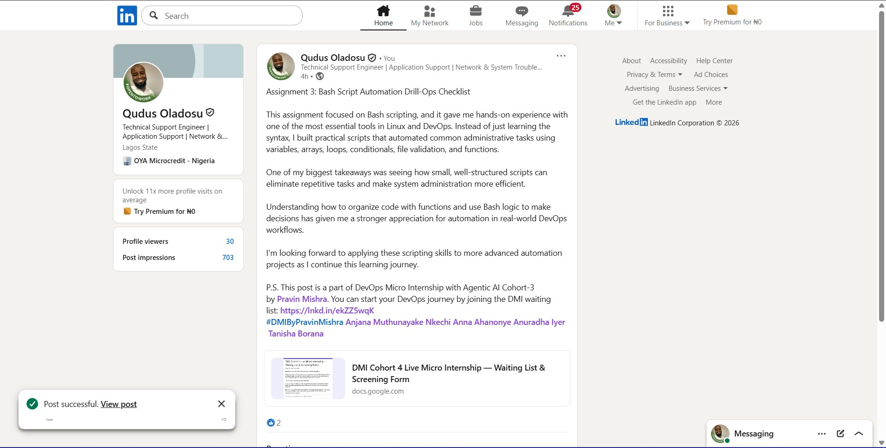

---

# GitHub Repository URL

Paste the URL of your GitHub folder or repository containing the assignment files here:

`https://github.com/AbdulQuduss/devops-micro-internship-pravinmishra.git`

---

# Submission Instructions

- Add all required screenshots in your submission
- Full Name must be visible in required screenshots and the Bash report
- All written answers must be in your own words
- Do not expose sensitive information (keys, passwords, AWS account IDs, tokens)
- GitHub URL must be included in this document

---

# Completion Checklist

- [ ] Task 1: Healthy baseline confirmed, workspace created (Screenshots 1–2, Notes answered)
- [ ] Task 2: CLAUDE.md created with all four sections (Screenshot 3, Notes answered)
- [ ] Task 3: Five-check plan produced by Claude using read-only tools (Screenshot 4, Notes answered)
- [ ] Task 4: `linux-triage.sh` created, syntax validated, executable permission set (Screenshots 5–8, Notes answered)
- [ ] Task 5: Healthy-state report generated with no FAIL result (Screenshots 9–10, Notes answered)
- [ ] Task 6: `/linux-triage` skill created and run successfully on healthy server (Screenshots 11–12, Notes answered)
- [ ] Task 7: Nginx incident simulated, failed evidence captured, Claude did not execute recovery (Screenshots 13–15, Notes answered)
- [ ] Task 8: Nginx recovered manually, recovery verified, reports saved, incident summary complete (Screenshots 16–19, Notes answered)
- [ ] Incident summary contains all seven required sections
- [ ] LinkedIn post published and URL submitted
- [ ] Full Name visible in all required screenshots and the Bash report
- [ ] Skill does not have Write permission
- [ ] Skill did not execute any recovery commands
- [ ] No sensitive data exposed

---

## 📌 About DMI & CloudAdvisory

DevOps Micro Internship (DMI) is a project-based DevOps program run by Pravin Mishra (The CloudAdvisory) focused on real-world execution, systems thinking, and career readiness.

It helps learners build strong DevOps foundations with hands-on experience.

---

## 📌 Resources

- 🌐 DMI Official Website: https://pravinmishra.com/dmi  
- 🎓 DevOps for Beginners (Udemy): https://www.udemy.com/course/devops-for-beginners-docker-k8s-cloud-cicd-4-projects/  
- 🎓 Agentic AI DevOps with Claude Code: https://www.udemy.com/course/ultimate-agentic-ai-devops-with-claude-code/  
- 🎓 DevOps with Claude Code: Terraform, EKS, ArgoCD & Helm: https://www.udemy.com/course/devops-with-claude-code-terraform-eks-argocd-helm/  
- ▶️ YouTube Playlist: https://www.youtube.com/playlist?list=PLFeSNDtI4Cho  
- 🔗 Pravin Mishra (LinkedIn): https://www.linkedin.com/in/pravin-mishra-aws-trainer/  
- 🏢 CloudAdvisory (LinkedIn): https://www.linkedin.com/company/thecloudadvisory/

---

*This submission is part of DevOps Micro Internship (DMI) Cohort 3 — Agentic AI Track.*