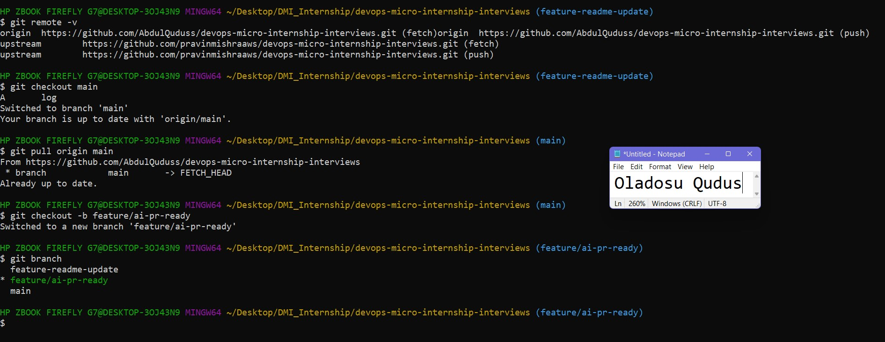
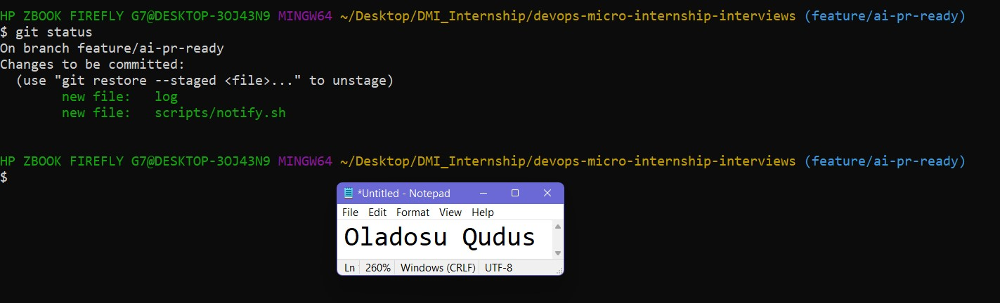
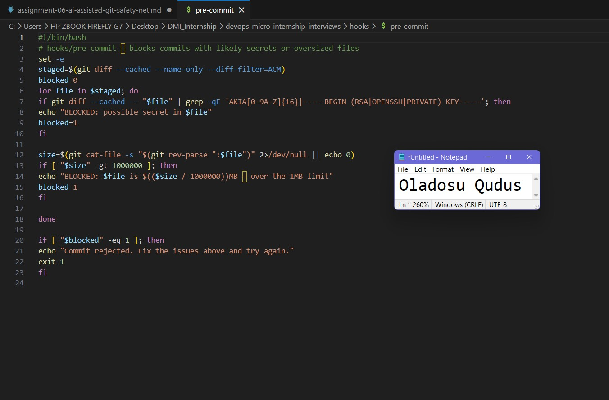
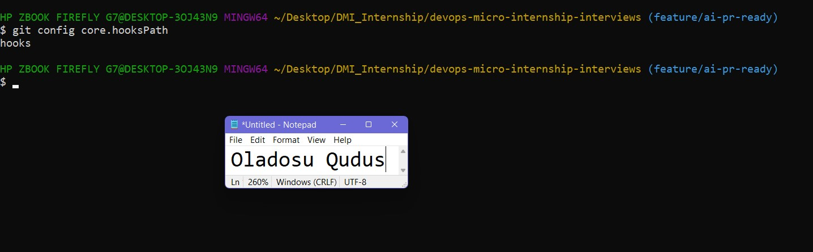
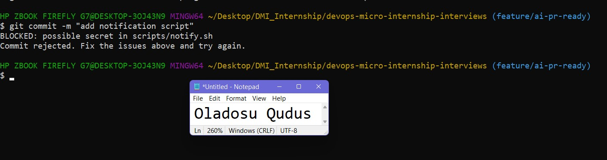
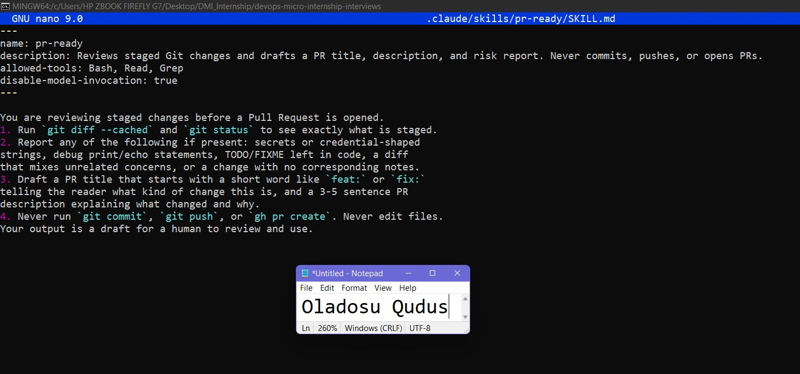
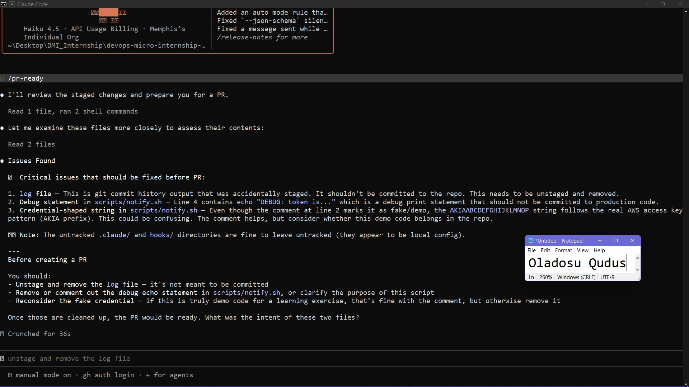
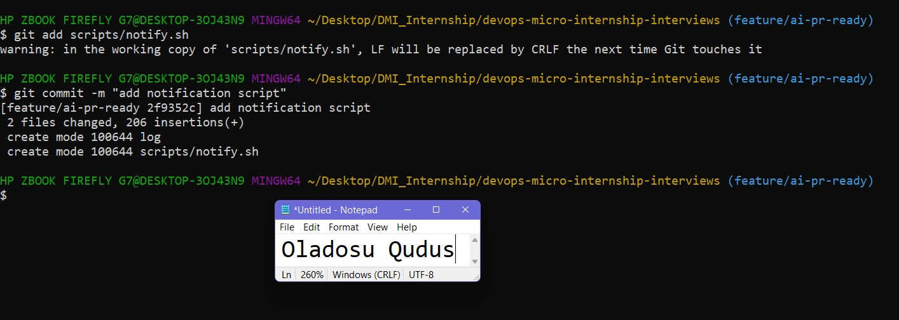
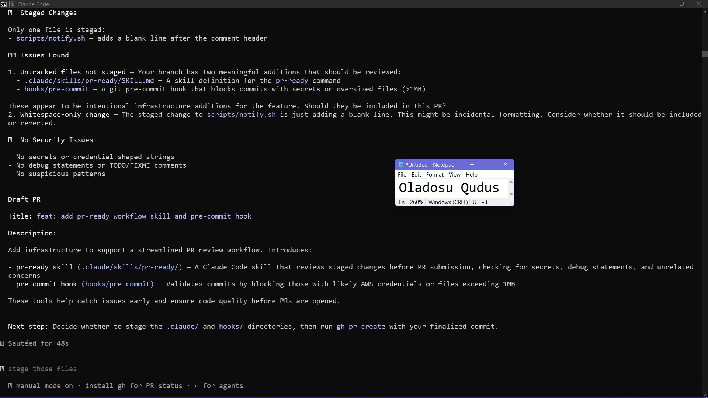
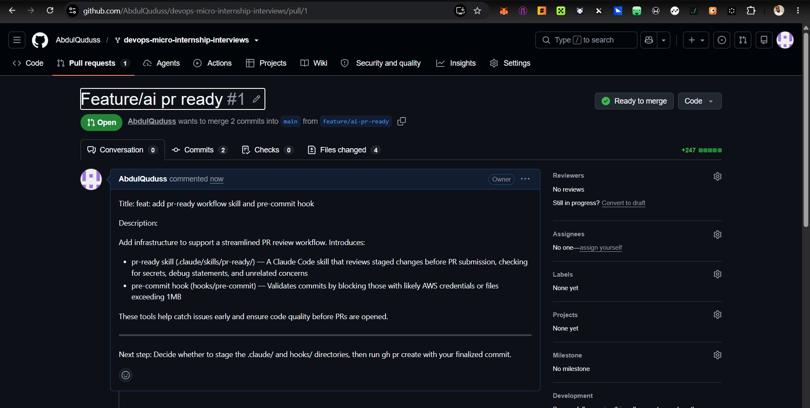

# Assignment 6 — Building an AI-Assisted Git Safety Net (PR Ready Check)

Part of the DevOps Micro Internship (DMI) Cohort 3 with Agentic AI

---

## Purpose

In Week 2 you built Claude Code hooks that block a dangerous action *before* it happens (`PreToolUse`), and a restricted skill that could look but not touch (`allowed-tools` without `Write`). In this assignment you will discover that Git has the exact same idea, decades older: a **pre-commit hook** that blocks a commit before it's created.

You will build both halves of a real "PR Ready" workflow:

1. A **Git hook that follows fixed rules** — scans staged changes for hardcoded secrets and oversized files and refuses the commit. No AI involved, no guessing, just a rule that gives the same answer every time.
2. A **restricted Claude Code skill** (`/pr-ready`) that reads your staged diff and drafts a Pull Request title, description, and a short list of things worth a second look — the kind of judgment a fixed rule can't make (mixed changes, missing context, unclear intent). The skill never commits, pushes, or opens the PR. You do that yourself, using its draft as a starting point.

This mirrors the Agentic Loop from Week 3's Linux triage assignment: **Gather → Analyze → Human Act → Verify**. The hook and the skill both gather and analyze; only you act.

---

# Task 0 — Confirm Your Fork and Create a Feature Branch

## Goal

Confirm you are working in your own fork, then create a dedicated branch for this assignment.

### Evidence

#### Screenshot 1 — Output of git remote -v and git branch showing the new branch

---

### Notes

**1. Why create a dedicated branch instead of doing this work on main?**

We create a dedicated branch so we can update the codebase without affecting the main application then we'll push the updated codebase to main once we're satisfied with the update.

---

# Task 1 — Stage a Change With Realistic Risk

## Goal

On your own fork of this repository (the one you've been submitting your DMI work in since onboarding), create a new branch and stage a change that a real reviewer should catch: a hardcoded-looking secret and a leftover debug statement.

### Evidence

#### Screenshot 1 — Output of  `git status` showing the staged file on feature/ai-pr-ready

---

### Notes

**1. Why does this assignment use an obviously fake key instead of a real one?**

We used a fake key because it's just a test script and for security reasons.

---

# Task 2 — Write a Real Git Pre-Commit Hook

## Goal

Create a tracked, shareable pre-commit hook that blocks a commit containing secret-like patterns or files over 1MB.

### Evidence

#### Screenshot 2 — `hooks/pre-commit` open in VS Code showing the full script

---

#### Screenshot 3 — Output of `git config core.hooksPath` confirming it points to `hooks`

---

### Notes

**1. Why is `hooks/pre-commit` tracked in the repo instead of living only in `.git/hooks/`?**

hooks/pre-commit is tracked in the repository so that the hook can be version-controlled and shared with everyone working on the project. By configuring core.hooksPath to hooks, Git uses the repository's tracked hook instead of the untracked .git/hooks directory. This ensures every developer gets the same hook logic after cloning the repository, making the workflow consistent and allowing updates to the hook to be committed and reviewed like any other source code.

---

**2. Compare this to `PreToolUse` from Week 2 Assignment 6. What does each one intercept, and what do they have in common?**

pre-commit protects the codebase before changes are committed, while PreToolUse protects the execution environment before commands are run.

---

# Task 3 — Prove the Hook Blocks the Risky Commit

## Goal

Attempt to commit the staged file from Task 1 and show the hook rejecting it.

### Evidence

#### Screenshot 4 — Terminal showing `git commit` rejected with the hook's "BLOCKED" message naming the exact file

---

### Notes

**1. Which line in `hooks/pre-commit` matched your fake key, and why did it match?**

Line 7 matched the key because the script is designed to detect strings that look like an AWS Access Key ID.

---

**2. Could this hook have caught a poorly-named variable that stores a secret without the `AKIA` prefix? What does that tell you about the limits of a fixed rule like this?**

No. The hook would not catch a poorly named variable or a secret that doesn't match the predefined script patterns. It relies on fixed rules such as matching the AKIA prefix or private key headers. This demonstrates that  it is effective for known secret formats but can miss unknown or custom secrets.

---

# Task 4 — Build the `/pr-ready` Skill

## Goal

Create a manually invoked Claude Code skill that reads your staged changes and produces a PR-readiness report and a draft PR description — without writing, committing, or pushing anything itself.

### Evidence

#### Screenshot 5 — `SKILL.md` frontmatter showing `allowed-tools: Bash, Read, Grep` (no `Write`) and `disable-model-invocation: true`

---

#### Screenshot 6 — `/pr-ready` output while the risky file is still staged, showing it flagged the secret and/or debug statement

---

### Notes

**1. Why does `/pr-ready` have `Bash` and `Read` but not `Write`?**

/pr-ready includes Bash so it can execute read-only Git commands like git diff --cached and git status, and Read so it can inspect the contents of staged files. It does not include Write because the skill is designed to be read-only, it reviews changes and drafts a PR without modifying files, committing code, or performing any Git operations that change the repository.

---

**2. The pre-commit hook and `/pr-ready` both looked at the same staged diff. Did they flag the same things? What did one catch that the other didn't?**

They did not flag the same issues. The pre-commit hook blocked the fake AWS key because it matched the AKIA secret regex, and it would also block any file larger than 1 MB. /pr-ready also noticed the credential-shaped string, but it additionally detected a debug echo statement that the pre-commit hook could not catch.

---

# Task 5 — Fix the Issues and Re-Verify

## Goal

Remove the secret and debug statement, then prove both gates now pass clean.

### Evidence

#### Screenshot 7 — `git commit` succeeding after the fix (no BLOCKED message)

---

#### Screenshot 8 — Second `/pr-ready` run showing a clean risk report and a drafted PR title + description

---

### Notes

**1. What exactly did you change to satisfy the pre-commit hook?**

I removed the fake access key which was causing the hook to trigger before.

---

# Task 6 — Push and Open a Pull Request Using the AI Draft

## Goal

Push your branch and open a real Pull Request, using `/pr-ready`'s drafted title and description as your starting point — read it critically and edit before you use it.

**Important:** Open this Pull Request with base repository set to **your own fork** — not the shared upstream `pravinmishraaws/devops-micro-internship-pravinmishra` repository. This assignment's hook and skill files are your own practice work, not a change meant for the shared class repo.

### Evidence

#### Screenshot 9 — Your Pull Request showing the base repository is your own fork, plus the title and description, with the `/pr-ready` draft visible for comparison (paste it in the PR conversation or your notes below)

---

#### PR Link

https://github.com/AbdulQuduss/devops-micro-internship-interviews/pull/1

---

### Notes

**1. What, if anything, did you edit in the AI's drafted PR description before using it? Why?**

I didn't didn't anything in the PR description 

---

**2. If you had blindly copy-pasted the AI's draft without reading it, what could go wrong?**

I didn't see any problem with the description

---

**3. Why does this PR need to target your own fork instead of the shared upstream repository?**

Because the updated files i'm trying to pull is on the forked repository.

---

# Task 7 — Map the Workflow to the Agentic Loop

## Goal

Explain this assignment's workflow using the same Gather → Analyze → Human Act → Verify structure from Week 3.

### Notes

**1. Which step(s) represent Gather?**

The Gather step is when the pre-commit hook and /pr-ready collect information about the staged changes. They run commands such as git diff --cached and git status to inspect the files that are about to be committed and gather the information needed for review.

---

**2. Which step(s) represent Analyze?**

The Analyze step is when the pre-commit hook scans the staged changes for secret patterns and oversized files, while /pr-ready reviews the same changes for issues such as debug statements, credential-like strings, TODO comments, mixed changes, and prepares a draft PR title and description. Both tools analyze the gathered information but in different ways.

---

**3. Which step is Human Act, and why must a human — not Claude — run `git commit`, `git push`, and open the PR?**

The Human Act step is when I review the findings, fix any reported issues, then run git commit, git push, and open the Pull Request. A human must perform these actions because they permanently change the Git repository. Claude is intentionally restricted to reviewing and drafting recommendations, it does not modify the repository or make publishing decisions on my behalf.

---

**4. Which step is Verify?**

The Verify step is after the fixes have been made. I rerun the pre-commit hook by attempting the commit and run /pr-ready again to confirm that no issues remain. If the commit succeeds and /pr-ready reports a clean review, it verifies that the repository is ready for the Pull Request.

---

**5. In one or two sentences: why do you need *both* the fixed-rule pre-commit hook and the AI skill? Isn't one enough?**

We need both because they serve different purposes. The pre-commit hook enforces fixed security rules by automatically blocking known risks like secret patterns and oversized files, while the /pr-ready skill provides contextual review by identifying issues such as debug statements, mixed changes, and unclear PRs that fixed rules cannot reliably detect. Together, they provide stronger protection than either one alone.

---

# Task 8 — LinkedIn Post

## Goal

Publish a LinkedIn post summarizing what you built and what you learned about combining fixed-rule safety checks with AI-assisted review.

### Evidence

#### LinkedIn Post URL

https://www.linkedin.com/posts/qudus-oladosu_dmi-devops-micro-internship-with-agentic-share-7486464914228928512-COLs/?utm_source=share&utm_medium=member_desktop&rcm=ACoAADJKiUcB2-kD6w7MGAUWTwb-d3Tp8qA3vuE

---

## Key Learnings

Add 3-5 bullet points on what you learned this week.

- Learned how to create and configure Git repositories, manage commits, and use branching strategies to keep changes organized and isolated.

- Gained hands-on experience with GitHub collaboration workflows, including forking repositories, configuring remotes, synchronizing with upstream, and creating Pull Requests.

- Built a Git pre-commit hook to automatically block commits containing secret-like patterns and oversized files, improving repository security.

- Created a restricted AI-powered /pr-ready skill to review staged changes, identify potential issues, and draft Pull Request descriptions without modifying the repository.

- Understood how combining fixed-rule automation with AI-assisted review provides a stronger workflow by enforcing security checks while offering contextual code review before a Pull Request is created.

---

# Submission Instructions

- Ensure `hooks/pre-commit` and `.claude/skills/pr-ready/SKILL.md` are committed to your GitHub repository
- Add all required screenshots to your submission
- All written answers must be in your own words
- Do not use a real secret or credential anywhere in your submission — the fake key in Task 1 is intentional and must stay clearly fake
- Open your Pull Request against your own fork, not the shared upstream repository
- Push your final changes to your forked repository
- Include your PR link and LinkedIn post URL

---

## GitHub Repository URL

Paste your forked repository URL here:

`https://github.com/AbdulQuduss/devops-micro-internship-interviews/`

---

# Completion Checklist

- [ ] Branch `feature/ai-pr-ready` created with a staged file containing a fake secret and a debug statement
- [ ] `hooks/pre-commit` created and tracked in the repo (not only in `.git/hooks/`)
- [ ] `core.hooksPath` configured to point at `hooks/`
- [ ] Pre-commit hook shown blocking the risky commit
- [ ] `.claude/skills/pr-ready/SKILL.md` created with correct `allowed-tools` (no `Write`) and `disable-model-invocation: true`
- [ ] `/pr-ready` run against the risky diff and shown flagging issues
- [ ] Risky file fixed; `git commit` succeeds cleanly
- [ ] `/pr-ready` re-run showing a clean report and drafted PR title/description
- [ ] Pull Request opened using the AI draft as a starting point, with your own fork as the base repository (not upstream), PR link included
- [ ] Agentic Loop mapping (Task 7) completed in your own words
- [ ] LinkedIn post published and URL submitted
- [ ] All required screenshots added
- [ ] GitHub repository URL provided

---

## 📌 About DMI & CloudAdvisory

DevOps Micro Internship (DMI) is a project-based DevOps program run by Pravin Mishra (The CloudAdvisory) focused on real-world execution, systems thinking, and career readiness.

It helps learners build strong DevOps foundations with hands-on experience.

---

## 📌 Resources

- 🌐 DMI Official Website: https://pravinmishra.com/dmi  
- 🎓 DevOps for Beginners (Udemy): https://www.udemy.com/course/devops-for-beginners-docker-k8s-cloud-cicd-4-projects/  
- 🎓 Agentic AI DevOps with Claude Code: https://www.udemy.com/course/ultimate-agentic-ai-devops-with-claude-code/  
- 🎓 DevOps with Claude Code: Terraform, EKS, ArgoCD & Helm: https://www.udemy.com/course/devops-with-claude-code-terraform-eks-argocd-helm/  
- ▶️ YouTube Playlist: https://www.youtube.com/playlist?list=PLFeSNDtI4Cho  
- 🔗 Pravin Mishra (LinkedIn): https://www.linkedin.com/in/pravin-mishra-aws-trainer/  
- 🏢 CloudAdvisory (LinkedIn): https://www.linkedin.com/company/thecloudadvisory/

---

*This submission is part of DevOps Micro Internship (DMI) Cohort 3 — Agentic AI Track.*
